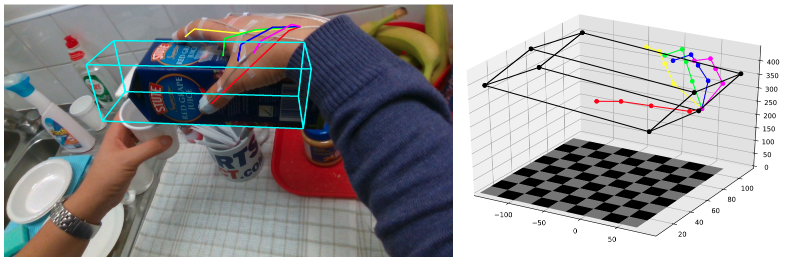
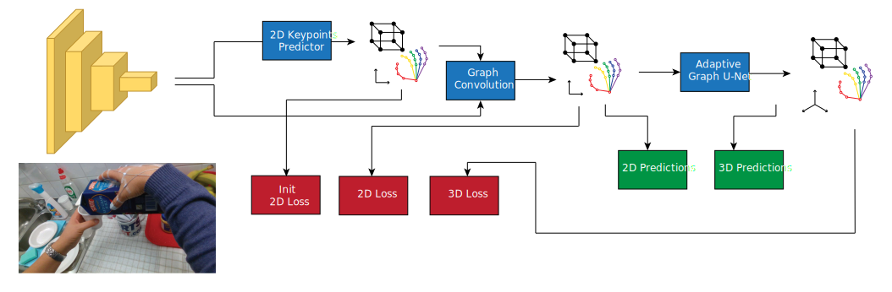
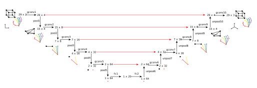

# HOPE-Net: A Graph-based Model for Hand-Object Pose Estimation
Codes for [**HOPE-Net paper**](https://arxiv.org/pdf/2004.00060.pdf) (CVPR 2020), a Graph Convolutional model for Hand-Object Pose Estimation (HOPE).

The goal of Hand-Object Pose Estimation (HOPE) is to jointly estimate the poses of both the hand and a handled object. Our HOPE-Net model can estimate the 2D and 3D hand and object poses in real-time, given a single image.
<div align="center">
    
</div>

## Architecture
The architecture of HOPE-Net. The model starts with ResNet as the image encoder and for predicting the initial 2D coordinates
of the joints and object vertices. The coordinates concatenated with the image features used as the features of the input graph of a 3 layered graph convolution to use the power of neighbors features to estimate the better 2D pose. Finally the 2D coordinates predicted in the previous step are passed to our Adaptive Graph U-Net to find the 3D coordinates of the hand and object.
<div align="center">
    
</div>

A schematic of our Adaptive Graph U-Net architecture, which is used to estimate 3D coordinates from 2D coordinates. In each of the pooling layers, we roughly cut the number of nodes in half, while in each unpooling layer, we double the number of nodes in the graph. The red arrows in the image are the skip layer features which are passed to the decoder to be concatenated with the unpooled features.
<div align="center">
    
</div>

## Datasets
To use the datasets used in the paper download [**First-Person Hand Action Dataset**](https://guiggh.github.io/publications/first-person-hands/) and [**HO-3D Dataset**](https://www.tugraz.at/index.php?id=40231) and update the root path in the `make_data.py` file located in each folder and run the `make_data.py` files to generate the `.npy` files.

## Test Pretrained Model
First download [**First-Person Hand Action Dataset**](https://guiggh.github.io/publications/first-person-hands/) and make the `.npy` files. Then download and extract the pretrained model with the command below and then run the model using the pretrained weights.

### GraphUNet
```
wget http://vision.soic.indiana.edu/wp/wp-content/uploads/graphunet.tar.gz
tar -xvf graphunet.tar.gz

python Graph.py \
  --input_file ./datasets/fhad/ \
  --test \
  --batch_size 64 \
  --model_def GraphUNet \
  --gpu \
  --gpu_number 0 \
  --pretrained_model ./checkpoints/graphunet/model-0.pkl
```

<!--
### HOPE-Net
```
wget http://vision.soic.indiana.edu/hopenet_files/checkpoints.tar.gz
tar -xvf checkpoints.tar.gz

python HOPE.py \
  --input_file ./datasets/fhad/ \
  --test \
  --batch_size 64 \
  --model_def HopeNet \
  --gpu \
  --gpu_number 0 \
  --pretrained_model ./checkpoints/fhad/model-0.pkl
```
-->


## Citation
Please cite our paper if this code helps your research.
```bibtex
@InProceedings{Doosti_2020_CVPR,
author = {Bardia Doosti and Shujon Naha and Majid Mirbagheri and David Crandall},
title = {HOPE-Net: A Graph-based Model for Hand-Object Pose Estimation},
booktitle = {The IEEE Conference on Computer Vision and Pattern Recognition (CVPR)},
month = {June},
year = {2020}
}
```
